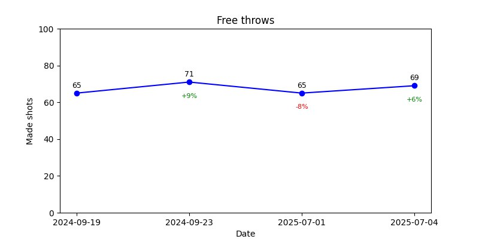

# Telegram Basketball Stats Bot 🏀

👉 [Читать на русском](README.ru.md)

A simple Telegram bot to track your basketball shot performance (three-pointers and free throws).

## Features

- Add shooting stats via `/add_shots`
- View stats with progress charts: `/threepoint_stats`, `/freethrow_stats`
- Delete specific records: `/delete_shot`
- View average accuracy: `/avg_stats`
- Switch language: `/language` (English / Russian)

## Example graph



## Installation

1. Clone the repository
2. Install the dependencies:
    ```bash
    pip install -r requirements.txt
    ```
3. Create a `.env` file and add your bot token:
    ```
    BOT_TOKEN=your_telegram_bot_token
    ```
4. Run the bot:
    ```bash
    python main.py
    ```

## Requirements

- Python 3.10+
- aiogram
- matplotlib
- python-dotenv

---

Feel free to open an issue or reach out if you need help!
